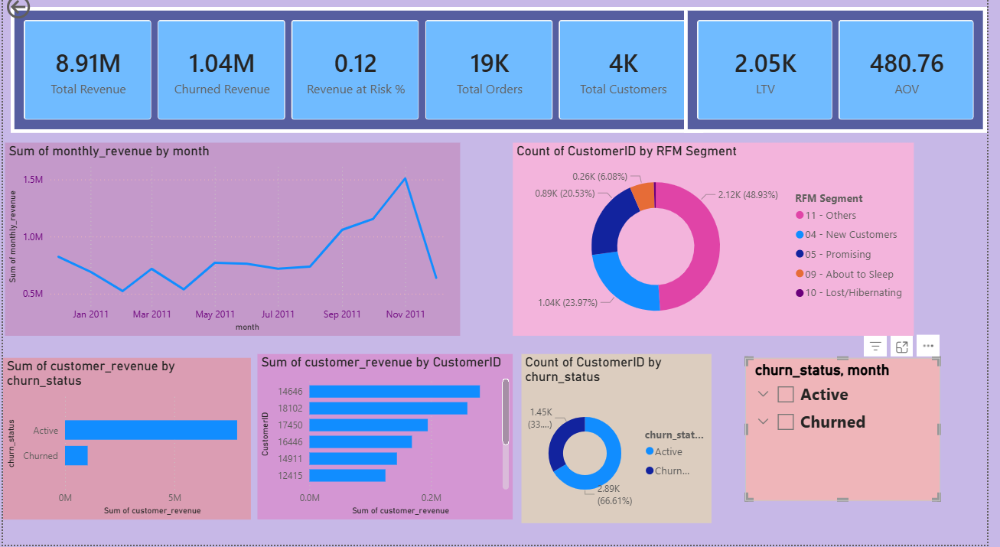
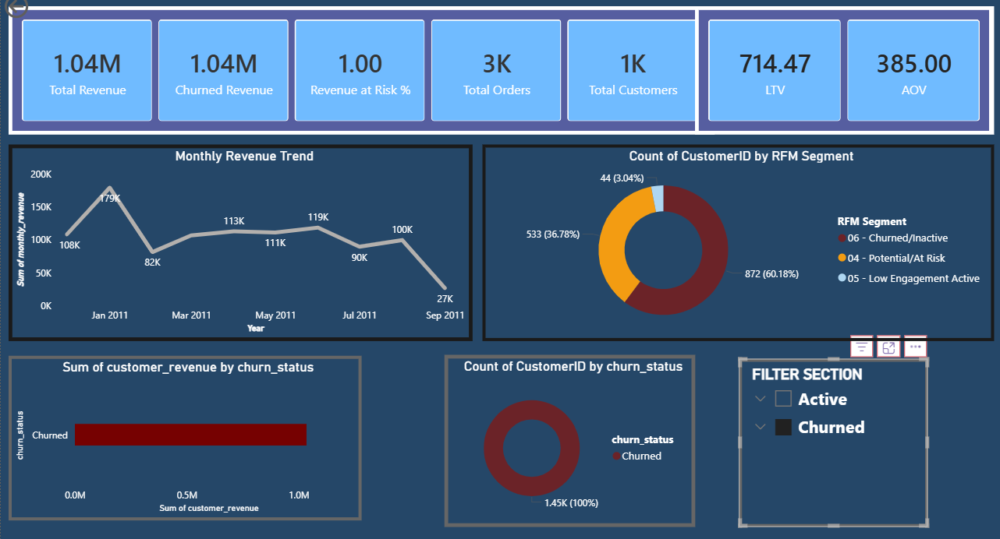
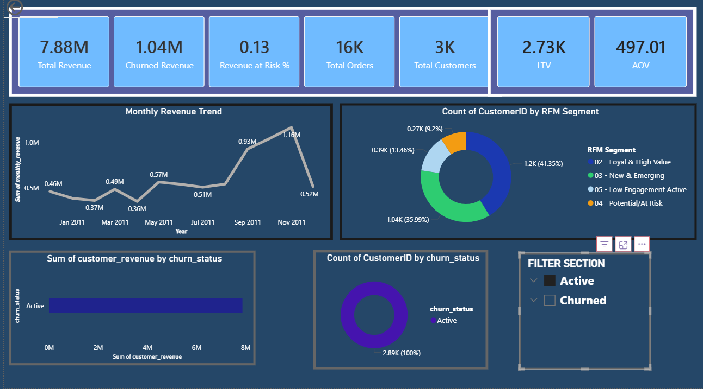

# 🚀 Expert Level Customer Churn Prediction and LTV Maximization

## 🌟 Project Goal & Overview

This project provides an expert-level, end-to-end data analytics solution for **E-commerce Customer Churn Prediction** and **Lifetime Value (LTV) Maximization**. The analysis transforms raw transaction data into a robust business intelligence tool, focusing on:

1.  **Full-Cycle Analysis:** Calculating advanced, dynamic metrics (LTV, AOV) across the entire customer journey.
2.  **Predictive Segmentation:** Utilizing **RFM (Recency, Frequency, Monetary)** logic to classify customers based on their purchasing behavior and churn risk.
3.  **Actionable Strategy:** Delivering precise, data-backed recommendations to optimize customer retention and marketing spend.

### 🔑 Key Technologies & Tools

| Category | Tools Used | Role in Project |
| :--- | :--- | :--- |
| **Data Preparation** | SQL (Advanced Feature Engineering) | Creation of 11 optimized tables for modeling. |
| **Data Modeling** | Power BI | Star Schema Implementation & Data Relationship Management. |
| **Advanced Analytics** | DAX | Dynamic LTV, AOV, and Complex RFM Scoring Logic. |

---

## 🔬 The Data Analytics Process: A Deep Dive into SQL

The complexity of this project is rooted in the **Data Preparation Phase**. Instead of relying on Power BI's Query Editor for heavy transformations, **11 sequential SQL queries** were executed to create optimized fact and dimension tables, ensuring model performance and analytical integrity.

### 📑 Detailed Breakdown of 11 SQL Files

| File Name | Purpose/Output Feature | Complexity & Business Rationale |
| :--- | :--- | :--- |
| `01_baseline_kpis.sql` | Baseline KPIs (Total Revenue, Orders) | Sets the initial aggregation context for performance checks. |
| `02_monthly_revenue_trend.sql` | Time Series Data | Pre-calculates monthly sums to optimize the trend chart in Power BI. |
| `03_customer_revenue.sql` | Monetary (M) Value | Aggregates total spend per customer for the RFM calculation and LTV base. |
| `04_purchase_frequency.sql` | Frequency (F) Value | Counts total transactions per customer for the RFM calculation. |
| `05_revenue_concentration.sql` | Revenue Distribution | Analyzes which customers contribute the most revenue (Pareto Principle check). |
| `06_last_purchase_recency.sql` | Recency (R) Value | Calculates days since the last purchase, crucial for churn risk. |
| `07_churn_check.sql` | Churn Status | The core logic to define if a customer is 'Active' or 'Churned'. |
| `08_revenue_impact_by_churn.sql` | Churned Revenue Metric | Calculates the exact revenue lost due to churn, vital for KPI cards. |
| `09_cohort_base_first_purchase.sql` | Cohort Start Date | Identifies the acquisition month for each customer for potential Cohort Analysis. |
| `10_cohort_activity.sql` | Cohort Activity Data | Prepares month-by-month activity data for retention rate tracking. |
| `11_rfm_base_table.sql` | Final RFM Base Table | Joins R, F, M metrics into the definitive table for Power BI modeling. |

---

## 🔗 Data Modeling and Advanced DAX Implementation

The SQL output was modeled in Power BI using an optimized Star Schema.

### A. RFM Scoring Implementation

* **Logic:** Used the `CEILING(RANKX(ALL(),...))` DAX structure to assign a **1-5 score** to R, F, and M metrics, ensuring proper quartile-based segmentation.
* **Segment Naming:** A final `RFM Segment` column was created using `SWITCH(TRUE(),...)` to classify customers into actionable groups (e.g., "Champions", "About to Sleep").

### B. Dynamic KPI Measures

Metrics were defined to adjust instantly based on the `churn_status` slicer:

* **LTV:** Calculated as `Total Revenue / Total Customers`.
* **AOV:** Calculated as `Total Revenue / Total Orders`.

---

## 📊 Key Business Insights and Strategic Recommendations

The analysis focuses on the comparison between the three main views (Overall, Active, Churned) to extract maximum value.

### 1. Overall Performance and Segmentation Overview

**A. Value Gap Analysis: High-Value Customers vs. Churned Customers**

| Metric | Active Customers | Churned Customers | Quantitative Insight |
| :--- | :--- | :--- | :--- |
| **LTV** | 2.73K | 714.47 | **3.8X Multiplier:** Active customers are nearly four times more valuable than churned customers, justifying premium retention efforts. |
| **AOV** | 497.01 | 385.00 | **29% Higher Spend:** Active customers spend significantly more per order, confirming they are higher-quality buyers. |

**Overall Performance and RFM Distribution**

---

### 2. RFM Analysis: Identifying and Prioritizing Risk

The RFM distribution confirms where immediate attention and resource allocation are needed:

* **Primary Churn Driver (Historical):** The **"Lost/Hibernating"** segment accounts for **~88%** of all Churned customers. This confirms that customers who churned were intrinsically low-value and had long since ceased activity.

**Churned Customer Profile (Understanding the Loss)**

* **Highest Immediate Risk (Active):** The largest segment among currently **Active** customers is **"About to Sleep" (~31%)**. This segment represents the immediate future of churn and must be prioritized for pre-emptive intervention.
* **Onboarding Failure:** The **"New Customers"** segment is large in both Active (~36%) and Churned (~16%) views, indicating a weak initial retention strategy.

**Active Customer Analysis (Targeting the Risk)**

---

### 3. Strategic Recommendations

| Recommendation Focus | Target RFM Segment | Actionable Strategy |
| :--- | :--- | :--- |
| **Churn Prevention** | **About to Sleep (~31% Active)** | Launch an urgent, personalized reactivation campaign (e.g., product tips, small discounts) aimed at driving a single purchase to restore their Recency Score. |
| **Acquisition Optimization** | **New Customers (~36% Active)** | Implement a mandatory automated workflow immediately after the first purchase to increase engagement and transition them into the "Potential Loyalist" segment. |
| **Loyalty Maximization** | **Champions / Loyalists** | Use the high Active LTV (2.73K) to justify investment in a premium Loyalty Program, maximizing retention of the highest-value cohort. |
